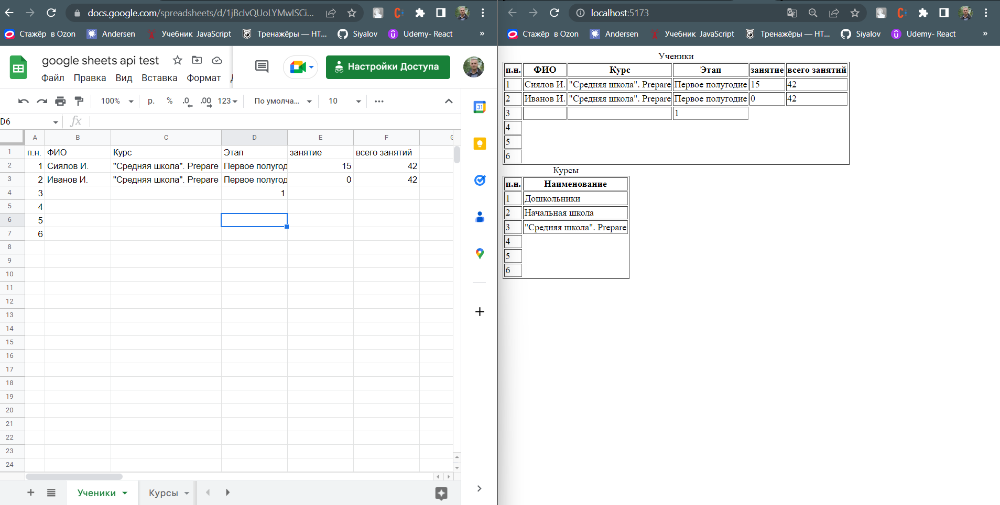
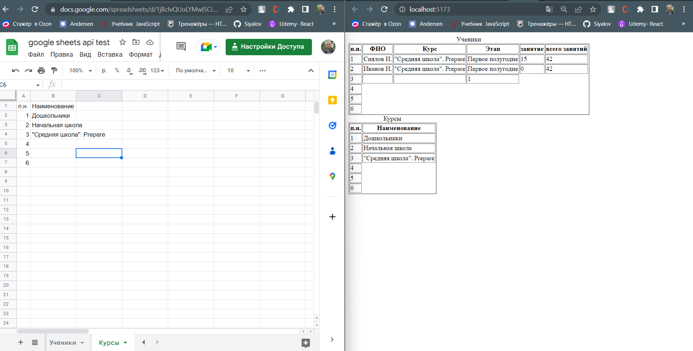

# Google sheets example (React, TypeScript)

## ScreenShots

## How to run

* Install dependencies:
  * `yarn install`
  * or `npm install`
* Rename and edit your `.env` (see `.env.sample`):
  | Variable | Description |
  |-|-|
  | `VITE_APP_API_KEY` | Your `Google API KEY`. You can obtain `API KEY` here: https://console.cloud.google.com/apis/credentials |
  | `VITE_APP_SPREADSHEET_ID` | `spreadsheetId` from URL: `https://docs.google.com/spreadsheets/d/{{SPREADSHEET_ID}}/edit#gid=0` |
* Run project:
  * `yarn dev`
  * or `npm run dev`

